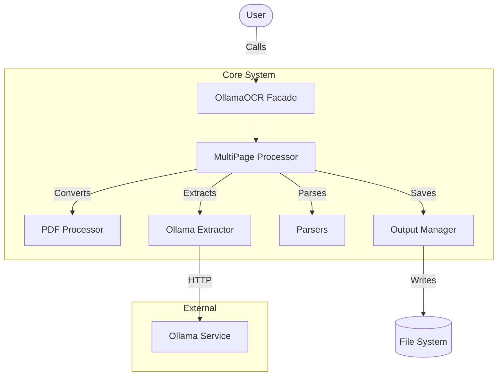
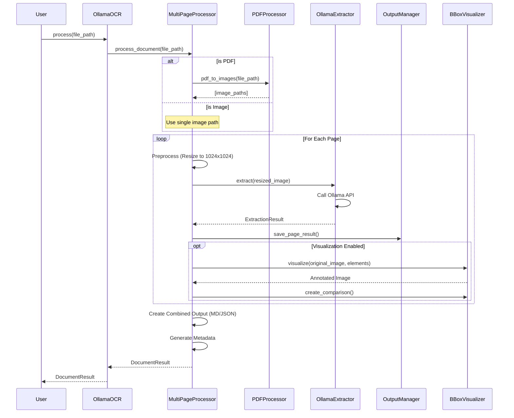
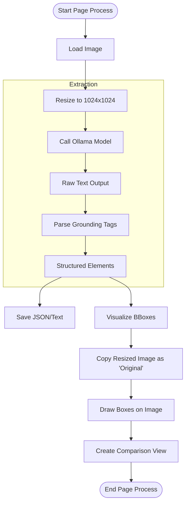
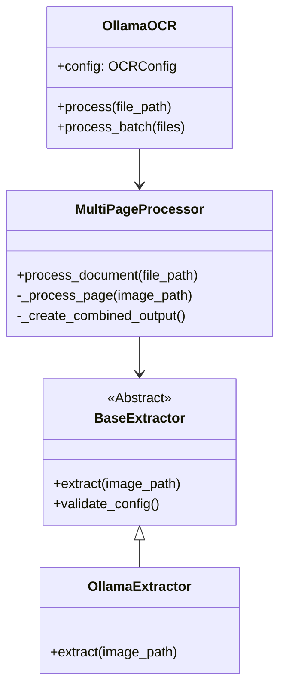

# DocumentParser Architecture

## 1. High-Level Design

The **DocumentParser** follows a layered architecture, separating concerns between orchestration, extraction, parsing, and storage.

## 2. Key Components

| Component | Responsibility |
|-----------|----------------|
| **OllamaOCR** (`main.py`) | The main entry point and facade. Simplifies API usage. |
| **MultiPageProcessor** | Orchestrates the entire pipeline: handles file conversion, loops through pages, and aggregates results. |
| **OllamaExtractor** | Handles the communication with the Ollama API, managing prompts and retries. |
| **PDFProcessor** | Converts PDF pages into high-quality images for the vision models. |
| **OutputManager** | Handles writing results to disk in various formats (JSON, MD). |

## 3. Detailed Processing Flow

### Document Processing Workflow

This sequence diagram illustrates the lifecycle of a `process_document()` call.

### Page Extraction Logic

The extraction process for a single page involves specific preprocessing to optimize for vision models.

## 4. Class Hierarchy

