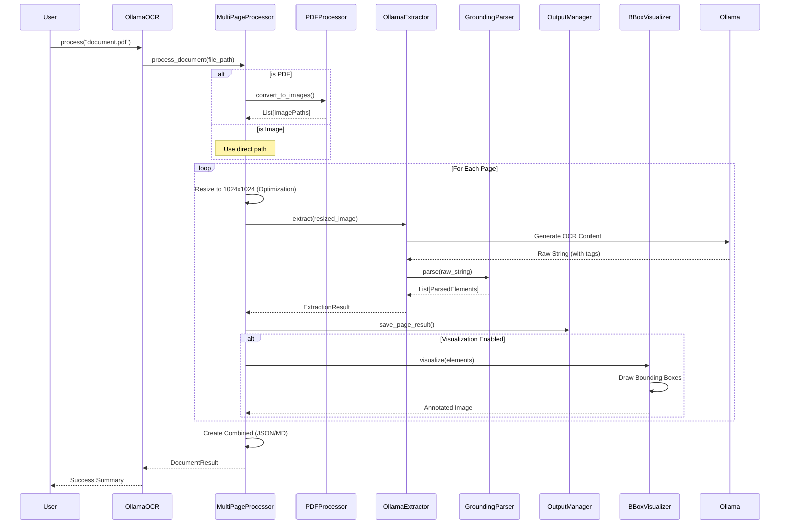

# DocumentParser: Comprehensive Documentation

## 1. Overview Section

### High-Level Summary
**DocumentParser** is a sophisticated, production-grade OCR (Optical Character Recognition) system designed to extract structured information from complex documents (PDFs and Images). It leverages **Ollama-hosted vision language models (VLMs)** such as DeepSeek OCR, LLaVA, and Qwen-VL to perform high-accuracy text extraction while preserving document layout through advanced grounding techniques.

### Main Purpose and Business Logic
The core purpose of DocumentParser is to bridge the gap between static document formats (unstructured) and machine-readable data (structured). It doesn't just "read" text; it "understands" the physical layout, identifying tables, headings, images, and text blocks with pixel-perfect bounding boxes.

**Business Logic Flow:**
1.  **Ingestion**: Accept single/multi-page PDFs or various image formats.
2.  **Transformation**: Convert PDFs to high-resolution images and normalize them (resizing to 1024x1024) to optimize VLM performance.
3.  **Extraction**: Call VLMs via the Ollama API with specialized prompts.
4.  **Parsing**: Decode the model's raw string output (which includes specific grounding tags) into structured data objects.
5.  **Visualization**: Generate annotated images showing detected elements for human verification.
6.  **Persistence**: Organize results into a structured directory tree with Markdown, JSON, and visual artifacts.

### Key Technologies and Dependencies
| Technology | Role |
| :--- | :--- |
| **Python 3.8+** | Core programming language |
| **Ollama** | Local hosting of Vision Language Models (VLMs) |
| **DeepSeek OCR** | Primary VLM for high-resolution grounding and extraction |
| **Pillow (PIL)** | Image processing, resizing, and drawing |
| **PyMuPDF (fitz)** | PDF manipulation and high-speed image conversion |
| **pdf2image** | Secondary PDF conversion fallback |
| **Mermaid** | Architecture and flow visualization |

### Target Audience / Use Cases
- **RAG Systems**: Providing clean, structured, and layout-aware text for better vector indexing.
- **Enterprise Automation**: Extracting data from invoices, forms, and technical manuals.
- **Accessibility**: Converting scanned documents into screen-reader-friendly Markdown.
- **Data Science**: Creating datasets from large-scale document repositories.

---

## 2. Architecture & Flow

### Detailed Processing Flow
The following diagram illustrates the sequence of events from document input to final output generated by the `OllamaOCR` facade.



### Component Roles
- **OllamaOCR (Facade)**: The main entry point. It simplifies the API for users, handling configuration defaults and basic validation.
- **MultiPageProcessor (Orchestrator)**: Manages the lifecycle of a document. It coordinates between PDF conversion, page-by-page extraction, and final result aggregation.
- **OllamaExtractor (Strategy)**: Handles the specific communication logic with the Ollama service, including prompt construction and response management.
- **GroundingParser (Interpreter)**: Specializes in parsing the `<|ref|>` and `<|det|>` tags produced by models like DeepSeek to extract coordinates and content.
- **BBoxVisualizer (Visualizer)**: Renders the detected bounding boxes onto the original images for visual audit and debugging.

---

## 3. Step-by-Step Code Explanation

### `main.py` -> `OllamaOCR.process()`
-   **Purpose**: Orchestrates the processing of a single file.
-   **Parameters**:
    - `file_path` (str): Path to input file.
    - `page_range` (tuple, optional): (start, end) indices.
    - `custom_prompt` (str, optional): Custom model prompt.
-   **Step-by-Step Logic**:
    1.  Validates file existence and extension (PDF/Image).
    2.  Prints a console summary of the configuration.
    3.  Calls `self.processor.process_document()`.
    4.  Captures and returns the `DocumentResult`.
-   **Dependencies**: `MultiPageProcessor`, `Path`, `utils`.
-   **Side Effects**: Directs file conversion and storage write operations.

### `parsers/grounding_parser.py` -> `parse()`
-   **Purpose**: Extracts structured elements from the model's tagged string output.
-   **Step-by-Step Logic**:
    1.  Splits raw text by line.
    2.  Uses Regex to find `<|ref|>TYPE<|/ref|><|det|>[[x1,y1,x2,y2]]<|/det|>`.
    3.  Extracts the `element_type` (e.g., table) and coordinates.
    4.  Aggregates following text lines until the next tag to form the `content`.
    5.  Builds a list of `ParsedElement` objects.
-   **Error Handling**: Catches malformed tags and skips them while continuing to parse the rest of the document.

---

## 5. Configuration Options & Presets

DocumentParser provides several pre-configured "presets" to balance between speed, storage usage, and extraction quality.

### Configuration Hierarchy
1.  **OutputConfig**: Controls *what* is saved and *where* (formats, visualizers).
2.  **OCRConfig**: Controls *how* the model behaves (model name, prompts, retries).
3.  **OllamaOCR**: The final instance that can also take direct keyword overrides.

### Preset 1: High Quality & Full Analysis
**Best for**: Deep analysis, debugging, and complex documents.
- Saves all artifacts: raw text, JSON, annotated images, and comparison views.
- Enables retries on model failure.

```python
from main import OllamaOCR
from config import OCRConfig, get_full_output_config

# 1. Get the Full Output configuration (saves everything)
output_config = get_full_output_config()
output_config.output_base_dir = "./detailed_results"

# 2. Create the OCR config with the output config
ocr_config = OCRConfig(
    model_name="deepseek-ocr:3b",
    output_config=output_config,
    retry_on_failure=True,
    max_retries=3
)

# 3. Initialize the system
ocr = OllamaOCR(config=ocr_config)
```

### Preset 2: Fast & Minimal (Batch Processing)
**Best for**: High-volume processing where disk space is a concern.
- Only saves the final Markdown and JSON data.
- Disables time-consuming visualizations.

```python
from main import OllamaOCR
from config import OCRConfig, get_minimal_output_config

# 1. Get Minimal Output configuration (JSON/MD only)
output_config = get_minimal_output_config()

# 2. Create OCR config with speed optimizations
ocr_config = OCRConfig(
    model_name="deepseek-ocr:3b",
    output_config=output_config,
    validate_output=False  # Skips some post-extraction checks for speed
)

ocr = OllamaOCR(config=ocr_config)
```

### Preset 3: Default "Out of the Box"
**Best for**: General purpose use.

```python
from main import OllamaOCR

# Simplest initialization uses default_config internally
ocr = OllamaOCR()
```

### Summary of Configuration Methods
| Method | Description |
| :--- | :--- |
| `get_default_output_config()` | Standard settings (JSON, MD, Raw Text). |
| `get_minimal_output_config()` | Speed focused, no images or raw text. |
| `get_full_output_config()` | Heavyweight, includes all visualizations and comparison views. |
| `create_quality_config()` | Pre-built `OCRConfig` with full output and retries enabled. |
| `create_fast_config()` | Pre-built `OCRConfig` with minimal output and parallel processing enabled. |

### Advanced: Model Parameters & Prompts
For fine-tuned control, you can pass parameters directly to the underlying model or select from a library of specialized prompts.

#### 1. Tuning Model Behavior
```python
# Create a config with custom model parameters
config = OCRConfig(
    model_name="deepseek-ocr:3b",
    temperature=0.0,      # More deterministic output
    num_ctx=8192,         # Larger context window for complex documents
    top_p=0.9
)
```

#### 2. Selecting Specialized Prompts
The system includes a library of prompts optimized for different document types.

```python
# Use a specific prompt for forms or flowcharts
config = OCRConfig(
    prompt_key="form_v1.0",       # Optimized for field/value extraction
    # OR
    # prompt_key="flowchart_v1.0" # Optimized for diagram text
)
```

**Common Prompt Keys:**
- `grounding_markdown_v1.0`: (Default) Layout-aware Markdown.
- `form_v1.0`: Best for structured forms.
- `ocr_japanese_v1.0`: Best for Japanese text extraction.
- `markdown_tables_v1.0`: Focused on complex table structure.

---

## 6. Use Case Examples

### `ParsedElement` (Dataclass)
| Property | Type | Description |
| :--- | :--- | :--- |
| `element_id` | `int` | Unique ID on the page |
| `element_type` | `str` | Type (table, text, image) |
| `bbox` | `List[int]` | Coordinates `[x1, y1, x2, y2]` |
| `content` | `str` | Text content of the element |

### `OCRConfig` (Configuration Object)
- **model_name**: Default `deepseek-ocr:3b`.
- **use_grounding**: Toggles bounding box detection.
- **quality_mode**: If True, uses higher DPI and slower but more accurate settings.

---

## 7. Configuration & Setup

### Prerequisites
1.  **Ollama**: Download and install from [ollama.com](https://ollama.com).
2.  **Model**: Pull the optimized model.
    ```bash
    ollama pull deepseek-ocr:3b
    ```

### Installation
```bash
pip install ollama Pillow pymupdf pdf2image
```

### Environment Variables
- `OLLAMA_HOST`: Set if your Ollama instance is not on `localhost:11434`.

---

## 8. API/Interface Documentation

### `OllamaOCR` Class
| Method | Description | Return |
| :--- | :--- | :--- |
| `process(file_path)` | Extract from single file | `DocumentResult` |
| `process_batch(list)` | Extract from multiple files | `List[DocumentResult]` |
| `get_info()` | Get current configuration status | `dict` |

> [!NOTE]
> The system automatically resizes images to 1024x1024 before processing. This is a critical optimization for DeepSeek-based models which are trained on this specific resolution.

> [!WARNING]
> Ensure your machine has at least 8GB of RAM for the 3B model, or 16GB+ for larger models like LLaVA 13B.
